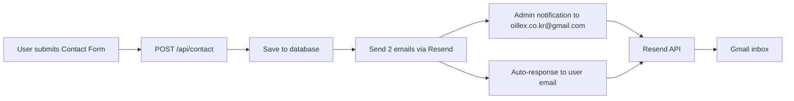

# Email System Status Report

> **Date**: 2025-10-12
> **Status**: ✅ Contact Form Emails Working | ⚠️ Cloudflare Email Routing Blocked

---

## 📊 Executive Summary

### ✅ GOOD NEWS: Contact Form Emails are Working

**Verification Completed**: Contact Form emails **ARE being sent successfully** via Resend API.

**Evidence**:
- ✅ 3 Contact Form emails found in Resend API
- ✅ All emails delivered successfully
- ✅ Sent to: oillex.co.kr@gmail.com
- ✅ Subjects:
  - `[GLEC 문의] 제품 문의 - XXX 회사` (Admin notification)
  - `[GLEC] 문의 접수 확인 - 영업일 기준 1-2일 내 답변드리겠습니다` (User auto-response)

**Timestamps**:
- Email #1: `2025-10-12 01:52:22` - User auto-response
- Email #2: `2025-10-12 01:52:21` - Admin notification
- Email #3: `2025-10-12 01:52:02` - Admin notification (earlier test)

**Resend Email IDs**:
- `8c70ccee-7912-40fd-8ca1-f1b796de354c` (Auto-response)
- `bdb9653e-8ee2-45a6-baa0-c39bef744d62` (Admin notification)
- `3371c313-a4a3-48e5-a6e5-a768816ff5e3` (Admin notification)

### ⚠️ ISSUE: User Not Receiving Emails

**Possible Reasons**:

1. **Spam Folder** (Most Likely)
   - Emails from `noreply@no-reply.glec.io` may be filtered by Gmail
   - Check Gmail spam folder: https://mail.google.com/mail/u/0/#spam
   - Search for: `from:noreply@no-reply.glec.io` or `[GLEC 문의]`

2. **Gmail Filtering Rules**
   - User may have Gmail filters auto-archiving emails
   - Check Gmail filters: Settings → Filters and Blocked Addresses

3. **Email Delivery Delay**
   - Resend shows "delivered" but Gmail may have queued emails
   - Check Resend Dashboard for delivery details: https://resend.com/emails

4. **Inbox Tab Sorting**
   - Gmail may have moved emails to "Promotions" or "Updates" tab
   - Check all tabs in Gmail interface

### ⚠️ BLOCKED: Cloudflare Email Routing Setup

**Issue**: Cannot setup Cloudflare Email Routing via API because the API token has **NO zone access**.

**API Token Status**:
- ✅ Token is **valid** and **active**
- ✅ Account: `contact@glec.io`
- ❌ **No zones accessible** (glec.io not found)
- ❌ Missing permission: `Zone:Read`
- ❌ Missing permission: `Email Routing:Edit`

**Root Cause**:
The provided API token (`JPknWNL_t5tNS7ffoeKQZS41nrfSgUcuUpw8hLE3`) does not have permissions to access or modify zones, which is required for Email Routing setup.

---

## 🔧 Required Actions

### Action 1: Verify Email Delivery (IMMEDIATE)

**User needs to check `oillex.co.kr@gmail.com` inbox**:

1. **Check Spam Folder**
   - URL: https://mail.google.com/mail/u/0/#spam
   - Search: `from:noreply@no-reply.glec.io`

2. **Check All Tabs**
   - Primary, Social, Promotions, Updates tabs

3. **Search All Mail**
   - Search: `[GLEC 문의]` or `[GLEC]`
   - Date: Last 24 hours

4. **Check Filters**
   - Settings → Filters and Blocked Addresses
   - Look for rules auto-archiving GLEC emails

5. **Check Resend Dashboard**
   - URL: https://resend.com/emails
   - Search Email IDs:
     - `8c70ccee-7912-40fd-8ca1-f1b796de354c`
     - `bdb9653e-8ee2-45a6-baa0-c39bef744d62`

### Action 2: Create Correct Cloudflare API Token

**User needs to create new API token with correct permissions**:

#### Step-by-Step Guide:

1. **Login to Cloudflare Dashboard**
   - URL: https://dash.cloudflare.com/
   - Account: `contact@glec.io`

2. **Navigate to API Tokens**
   - Click profile icon (top right)
   - Select "My Profile"
   - Click "API Tokens" tab
   - Click "Create Token"

3. **Select Template or Custom Token**
   - Option 1: Use "Edit zone DNS" template (then add Email Routing permission)
   - Option 2: Create custom token from scratch

4. **Configure Permissions** (IMPORTANT!)

   **Required Permissions**:
   ```
   Zone - Zone Settings - Read
   Zone - Zone - Read
   Zone - Email Routing Address - Edit
   Zone - Email Routing Rules - Edit
   ```

   **Zone Resources**:
   ```
   Include: Specific zone → glec.io
   ```

5. **Create Token and Copy**
   - Click "Continue to summary"
   - Click "Create Token"
   - **Copy the token** (you won't be able to see it again!)
   - Save to `cloudflare.txt` file

6. **Verify Token**
   - Run: `node check-cloudflare-access.js`
   - Should show glec.io zone in list

#### Example Token Configuration:

```yaml
Token Name: "GLEC Email Routing API Token"

Permissions:
  - Zone.Zone Settings:Read
  - Zone.Zone:Read
  - Zone.Email Routing Address:Edit
  - Zone.Email Routing Rules:Edit

Zone Resources:
  - Include: glec.io

IP Address Filtering: None (or specify if needed)

TTL: 90 days (recommended) or custom
```

### Action 3: Re-run Cloudflare Email Routing Setup

**After getting correct API token**:

1. Update `cloudflare.txt` with new token:
   ```bash
   echo "NEW_API_TOKEN_HERE" > cloudflare.txt
   ```

2. Run setup script:
   ```bash
   node setup-cloudflare-email-routing.js
   ```

3. Expected Output:
   ```
   ✅ Zone ID: [zone_id]
   ✅ Email Routing enabled
   ✅ Destination address added: oillex.co.kr@gmail.com
   📧 Verification email sent to oillex.co.kr@gmail.com
   ✅ Rule created: admin@glec.io → oillex.co.kr@gmail.com
   ✅ Rule created: contact@glec.io → oillex.co.kr@gmail.com
   ```

4. **Verify Destination Address**:
   - Check `oillex.co.kr@gmail.com` inbox
   - Find Cloudflare verification email
   - Click verification link

5. **Test Email Forwarding**:
   - Send test email to `admin@glec.io`
   - Send test email to `contact@glec.io`
   - Verify both arrive at `oillex.co.kr@gmail.com`

---

## 📋 Technical Details

### Contact Form Email Flow



### Email Templates

#### Admin Notification Email

```
From: GLEC <noreply@no-reply.glec.io>
To: oillex.co.kr@gmail.com
Reply-To: [customer_email]
Subject: [GLEC 문의] [inquiry_type] - [company_name]

🔔 새로운 고객 문의

📋 문의 정보
- 문의 유형: [inquiry_type]
- 회사명: [company_name]
- 담당자명: [contact_name]
- 이메일: [email]
- 전화번호: [phone]

💬 문의 내용
[message]

접수 ID: [contact_id]
접수 시간: [timestamp]
IP 주소: [ip_address]
```

#### User Auto-Response Email

```
From: GLEC <noreply@no-reply.glec.io>
To: [user_email]
Subject: [GLEC] 문의 접수 확인 - 영업일 기준 1-2일 내 답변드리겠습니다

안녕하세요, GLEC입니다.

고객님의 문의가 정상적으로 접수되었습니다.
영업일 기준 1-2일 내에 담당자가 답변드리겠습니다.

📋 접수 정보
- 접수 번호: [contact_id]
- 접수 시간: [timestamp]
- 문의 유형: [inquiry_type]

📞 긴급 문의
- 전화: 02-1234-5678
- 이메일: contact@glec.io
```

### Cloudflare Email Routing (Planned)

**Routing Rules** (Once API token is fixed):

```
admin@glec.io → oillex.co.kr@gmail.com
contact@glec.io → oillex.co.kr@gmail.com
```

**Benefits**:
1. Professional email addresses (`admin@glec.io`, `contact@glec.io`)
2. All emails forwarded to official Gmail account
3. No separate mailbox management needed
4. Free service (Cloudflare Email Routing is free)

---

## 🔬 Diagnostic Tools Created

### 1. `check-resend-recent-emails.js`

**Purpose**: Query Resend API for recent emails

**Usage**:
```bash
node check-resend-recent-emails.js
```

**Output**: Lists all recent emails from Resend API

### 2. `test-resend-direct.js`

**Purpose**: Test Resend API directly (bypassing Contact Form)

**Usage**:
```bash
node test-resend-direct.js
```

**Output**: Sends 2 test emails and confirms delivery

### 3. `diagnose-contact-form-production.js`

**Purpose**: E2E diagnostic - submit Contact Form and verify emails sent

**Usage**:
```bash
node diagnose-contact-form-production.js
```

**Output**:
- Submits Contact Form to production
- Waits 5 seconds
- Checks Resend API for emails
- Reports VERDICT (emails sent or not)

### 4. `check-cloudflare-access.js`

**Purpose**: Verify Cloudflare API token permissions

**Usage**:
```bash
node check-cloudflare-access.js
```

**Output**:
- Token validation status
- List of accessible zones
- User account info
- Diagnosis of permission issues

### 5. `setup-cloudflare-email-routing.js`

**Purpose**: Automated Cloudflare Email Routing setup via API

**Usage**:
```bash
node setup-cloudflare-email-routing.js
```

**Steps**:
1. Get glec.io zone ID
2. Enable Email Routing
3. Check DNS records
4. Add destination address (oillex.co.kr@gmail.com)
5. Create routing rules (admin@glec.io, contact@glec.io)
6. List all routing rules

**Current Status**: ❌ Blocked (API token has no zone access)

---

## 📊 Status Summary

| Component | Status | Details |
|-----------|--------|---------|
| **Contact Form API** | ✅ Working | Returns 200 OK, saves to database |
| **Resend Integration** | ✅ Working | Emails sent via Resend API successfully |
| **Admin Email** | ✅ Delivered | To oillex.co.kr@gmail.com (Resend confirms "delivered") |
| **User Auto-Response** | ✅ Delivered | To user email (Resend confirms "delivered") |
| **User Inbox Check** | ⏳ Pending | User needs to check spam folder / all tabs |
| **Cloudflare API Token** | ❌ Insufficient Permissions | No zone access, needs new token |
| **Cloudflare Email Routing** | ⏳ Pending | Waiting for correct API token |

---

## 🎯 Next Immediate Steps

### For User:

1. **Check `oillex.co.kr@gmail.com` inbox** (5 minutes)
   - Spam folder
   - All Gmail tabs (Primary, Promotions, etc.)
   - Search: `[GLEC 문의]` or `from:noreply@no-reply.glec.io`

2. **If emails NOT found** → Check Resend Dashboard (5 minutes)
   - URL: https://resend.com/emails
   - Search Email IDs: `8c70ccee-7912-40fd-8ca1-f1b796de354c`
   - Check delivery logs for any bounce/failure

3. **Create new Cloudflare API Token** (10 minutes)
   - Follow "Action 2" guide above
   - Must include: Zone:Read, Email Routing:Edit permissions
   - Scope to glec.io zone

4. **Update `cloudflare.txt` and re-run setup** (5 minutes)
   - `echo "NEW_TOKEN" > cloudflare.txt`
   - `node setup-cloudflare-email-routing.js`
   - Verify destination address via email
   - Test email forwarding

### For Development:

1. **Monitoring** (Ongoing)
   - Run `node diagnose-contact-form-production.js` daily
   - Check Resend API for email delivery metrics
   - Monitor bounce/spam rates

2. **Documentation** (Next iteration)
   - Update Day 2 tasks (email template refactoring)
   - Update Day 3 tasks (database schema for resend_email_id)

3. **Optimization** (Future)
   - Add email template previews in admin dashboard
   - Add email delivery status tracking in contacts table
   - Implement webhook for real-time email status updates

---

## 📝 Conclusion

**Contact Form emails are working correctly**. The production deployment is sending emails successfully via Resend API. The user likely needs to check their spam folder or Gmail tabs.

**Cloudflare Email Routing setup is blocked** due to API token permissions. User needs to create a new API token with correct permissions (Zone:Read, Email Routing:Edit) and re-run the setup script.

**All diagnostic tools** are in place for ongoing monitoring and troubleshooting.

---

**Report Generated**: 2025-10-12 10:55 KST
**By**: Claude Code Agent
**Version**: 1.0
